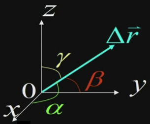

&emsp;
# 直角坐标系下的位移、速度、加速度

## 1 位移

    

>位矢
$$\vec{r}_1=x_1 \vec{i}+y_1 \vec{j}+z_1 \vec{k} \quad \vec{r}_2=x_2 \vec{i}+y_2 \vec{j}+z_2 \vec{k}$$

>位移
$$\begin{aligned}
\Delta \vec{r}=\vec{r}_2-\vec{r}_1 &=\Delta x \vec{i}+\Delta y \vec{j}+\Delta z \vec{k} \\
& =\left(x_2-x_1\right) \vec{i}+\left(y_2-y_1\right) \vec{j}+\left(z_2-z_1\right) \vec{k}
\end{aligned}$$

>位移的大小
$$\begin{aligned}|\Delta \vec{r}| &=\left|\vec{r}_2-\vec{r}_1\right| \\
&=\sqrt{\left(x_2-x_1\right)^2+\left(y_2-y_1\right)^2+\left(z_2-z_1\right)^2}\end{aligned}$$

>位移的方向
- 三个方向的分量, 或者说投影
$$\cos \alpha=\frac{\Delta x}{|\Delta \vec{r}|}, \quad \cos \beta=\frac{\Delta y}{|\Delta \vec{r}|}, \quad \cos \gamma=\frac{\Delta z}{|\Delta \vec{r}|}$$

