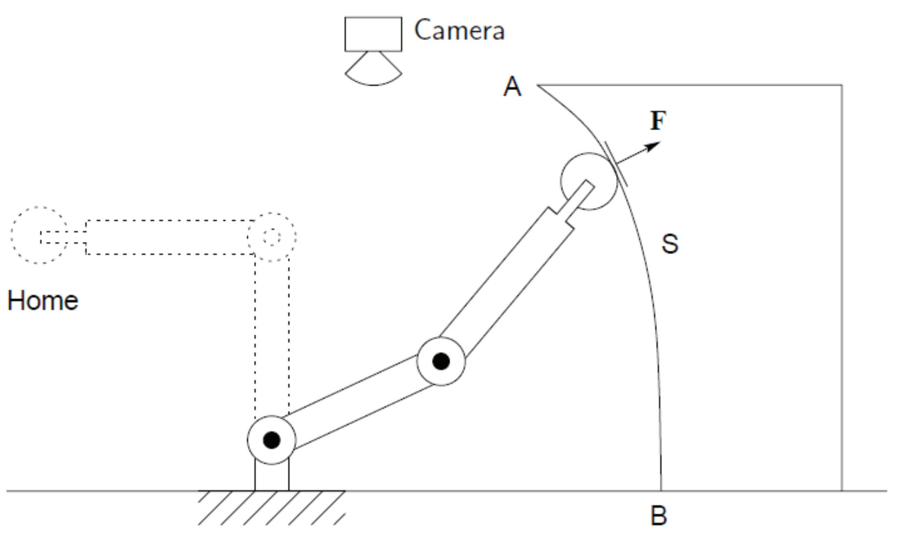

&emsp;
# Intro

## Revisiting mechanics problems
- Task 1: how to move the robot between 'Home' and a target position?
- Task 2: how to apply a desired force $F$ to the surface S?

    

## Motion
- motion representation
- motion of rigid bodies
- matrix operation

## Position, velocity and acceleration

A systematic method to describe motion:
- derive an equation for position
- derivative of position w.r.t. time: velocity
- derivative of velocity w.r.t. time: acceleration

## Motion of a point

- Position is a quantity with magnitude and direction, which can be represented by a vector
- Vectors can be represented graphically, with the length corresponding to the magnitude, and the direction set by an angle against a coordinate frame or another vector
- Velocity and acceleration can be also represented by a vector