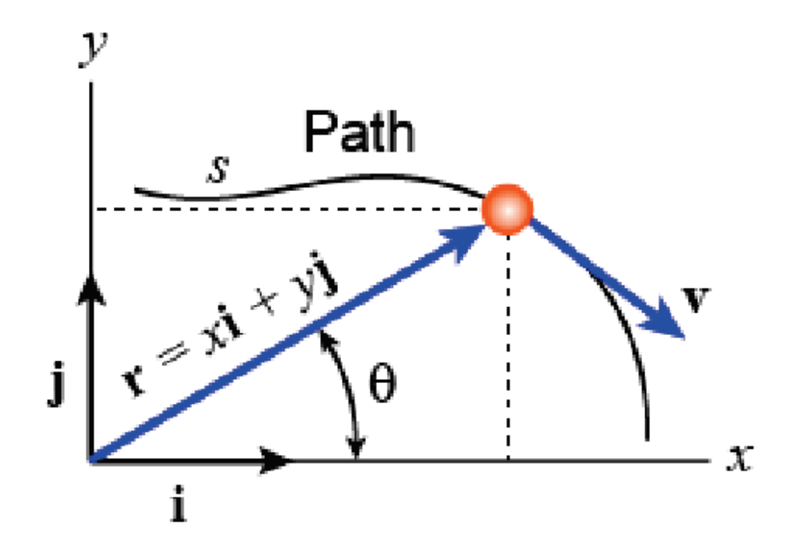

&emsp;
# Rectangular coordinate frame

position $\vec{r}=x \vec{\imath}+y \vec{\jmath}\ $  or  $\ \vec{r}=\left[\begin{array}{l}x \\ y \end{array}\right]$

    

>vector
- bold font or $\overrightarrow{()}$

>magnitude
- $r=|\vec{r}|$

>direction
- $\theta$

>coordinates
- $x, y$
- $x=r \cos \theta,\ y=r \sin \theta$

>unit vectors
- $\vec{\imath}, \vec{\jmath}$
- $\vec{\imath}=\left[\begin{array}{l}1 \\ 0\end{array}\right], \vec{\jmath}=\left[\begin{array}{l}0 \\ 1\end{array}\right]$

>velocity (time derivative of position using product rule):
$$\vec{v}=\dot{\vec{r}}=\dot{x} \vec{\imath}+x \dot{\vec{\imath}}+\dot{y} \vec{\jmath}+y \dot{\vec{\jmath}}$$

>time derivative
- $\dot{()}=\frac{d()}{d t}$

>double derivative
-  $\ddot{()}$
>velocity (time derivative of position)
$$\vec{v}=\dot{\vec{r}}=\dot{x} \vec{\imath}+x \dot{\vec{\imath}}+\dot{y} \vec{\jmath}+y \dot{\vec{\jmath}}$$
- if coordinate frame is fixed >
    $$\dot{\vec{\imath}}=\dot{\vec{\jmath}}=\overrightarrow{0}$$
- then $\vec{v}=\dot{x} \vec{\imath}+\dot{y} \vec{\jmath}=v_x \vec{\imath}+v_y \vec{\jmath}$
    
>acceleration (derivative of velocity) in a fixed coordinate frame:
$$\vec{a}=\dot{\vec{v}}=\dot{v}_x \vec{\imath}+\dot{v}_y \vec{\jmath}=a_x \vec{\imath}+a_y \vec{\jmath}$$
- where we have used
    $$\dot{\vec{\imath}}=\dot{\vec{\jmath}}=\overrightarrow{0}$$

What if the coordinate frame is moving?

