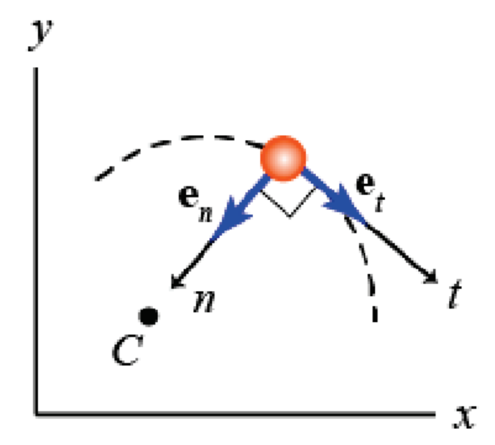

&emsp;
# $n-t$ coordinate frame
- $t$-axis: tangential to the path curve
- $n$-axis: perpendicular to the $t$-axis and is directed toward the centre of curvature

    

$n-t$ coordinate frame is attached to, and moves with, a point, so there is no position vector

>velocity (always tangential to the path):
$$\vec{v}=\dot{s} \vec{e}_t=v \vec{e}_t$$
- where (using `arc length formula` $\mathrm{d} s=\rho \mathrm{d} \theta$ ) $v=\rho \dot{\theta}$, similar as in polar coordinate frame

>acceleration
$$
\begin{aligned}
\vec{a} & =\dot{\vec{v}} \\
& =\mathrm{d}\left(v \vec{e}_t\right) / \mathrm{d} t \\
& =\dot{v} \vec{e}_t+\frac{v^2}{\rho} \vec{e}_n \\
& =\rho \ddot{\theta} \vec{e}_t+\frac{v^2}{\rho} \vec{e}_n
\end{aligned}$$

Recall polar coordinate frame for rotation 

$$\vec{a}=-r \dot{\theta}^2 \vec{e}_r+r \ddot{\theta} \vec{e}_\theta$$ 
with $v=\rho \dot{\theta}$ and $\rho=r$