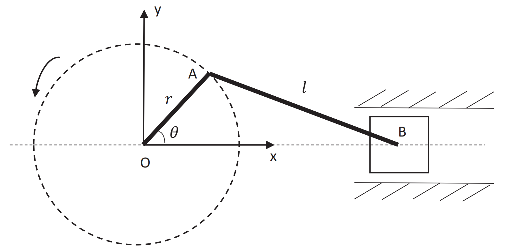
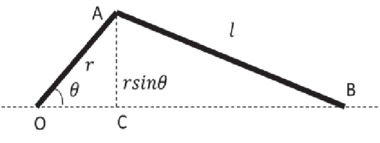
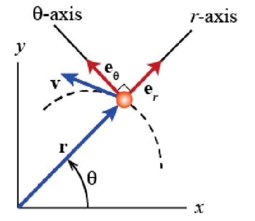

&emsp;
# Example 

    

- crank with a radius $r$ rotates about point $O$
- rod with a length $l$ connects crank AO and slider at point $B$
- $\theta, \dot{\theta}$ and $\ddot{\theta}$ are given

&emsp;
## Questions
- Calculate the velocity of the slider as a function of $\theta, \dot{\theta}$.
- Using a polar coordinate frame, derive the equations for the tangential and normal accelerations of point $A$.
- Determine the equations for the magnitude and angle of acceleration vector of point $A$.

&emsp;
## Solutions

- position of slider:
$$x_B=r \cos \theta+\sqrt{l^2-r^2 \sin ^2 \theta}$$
- velocity of slider:
$$v_B=\dot{x}_B=-r \dot{\theta} \sin \theta-\frac{r^2 \dot{\theta} \sin \theta \cos \theta}{\sqrt{l^2-r^2 \sin ^2 \theta}}$$

    

&emsp;

- position of point $A: \vec{r}=r \vec{e}_r$
- velocity: $\vec{v}=\dot{\vec{r}}=\mathrm{d}\left(r \vec{e}_r\right) / \mathrm{d} t=r \dot{\vec{e}}_r=r \dot{\theta} \vec{e}_\theta$
- acceleration:
$$\begin{aligned}
\vec{a} & =\dot{\vec{v}}=\mathrm{d}\left(r \dot{\theta} \vec{e}_\theta\right) / \mathrm{d} t \\
& =-r \dot{\theta}^2 \vec{e}_r+r \ddot{\theta} \vec{e}_\theta
\end{aligned}$$

    

&emsp;

- magnitude of acceleration vector:
$$
|\vec{a}|=\sqrt{\left(r \dot{\theta}^2\right)^2+(r \ddot{\theta})^2}=r \sqrt{\dot{\theta}^4+\ddot{\theta}^2}
$$
- angle of acceleration vector: $-\arctan \frac{\dot{\theta}^2}{\ddot{\theta}}$