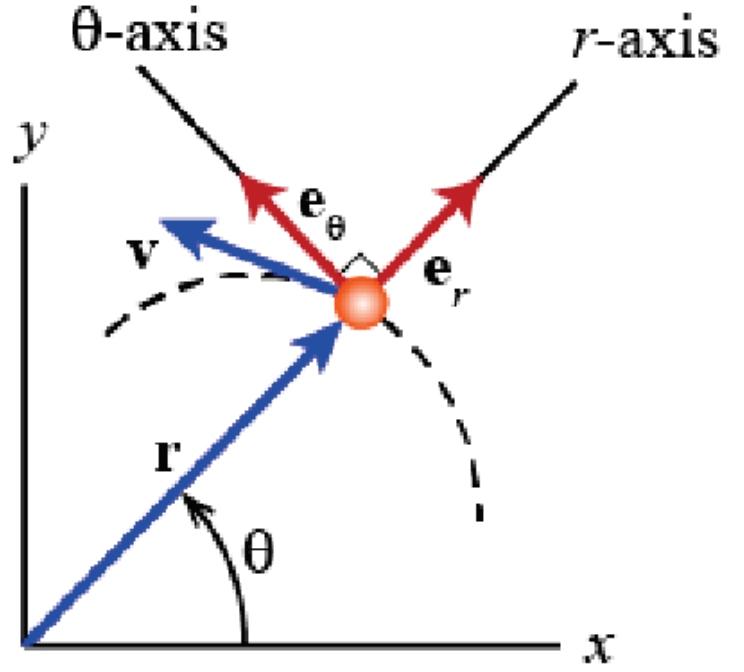

&emsp;
# Polar coordinate frame

position: $\vec{r}=r \vec{e}_r$

    

- $r$ : magnitude of $\vec{r}$

- $\vec{e}_r, \vec{e}_\theta$ : unit vectors
- $\vec{e}_r=\left[\begin{array}{c}\cos \theta \\ \sin \theta\end{array}\right], \vec{e}_\theta=\left[\begin{array}{c}-\sin \theta \\ \cos \theta\end{array}\right]$ in rectangular coordinate frame x-y
- velocity (using `product rule`):
    $$\begin{aligned}
    \vec{v} & =\dot{\vec{r}}=\mathrm{d}\left(r \vec{e}_r\right) / \mathrm{d} t \\
    & =\dot{r} \vec{e}_r+r \dot{\vec{e}}_r=\dot{r} \vec{e}_r+r \dot{\theta} \vec{e}_\theta
    \end{aligned}$$

    where (using `chain rule`):
    $$\dot{\vec{e}}_r=\mathrm{d}\left[\begin{array}{c}
    \cos \theta \\ \sin \theta
    \end{array}\right] / \mathrm{d} t=\dot{\theta} \vec{e}_\theta$$

- velocity: $\vec{v}=\dot{r} \vec{e}_r+r \dot{\theta} \vec{e}_\theta$
- for rotation: $\dot{r}=0$ so $\vec{v}=r \dot{\theta} \vec{e}_\theta$
    - in direction of $\vec{e}_\theta$
    - magnitude is $r \dot{\theta}$

- acceleration:
    $$\begin{aligned}
    \vec{a} & =\dot{\vec{v}} \\
    & =\mathrm{d}\left(\dot{r} \vec{e}_r+r \dot{\vec{e}}_r\right) / \mathrm{d} t \\
    & =\left(\ddot{r}-r \dot{\theta}^2\right) \vec{e}_r+(r \ddot{\theta}+2 \dot{r} \dot{\theta}) \vec{e}_\theta
    \end{aligned}$$
    where we have used
    $$\dot{\vec{e}}_\theta=-\dot{\theta} \vec{e}_r$$

- centrifugal: $-r \dot{\theta}^2 \vec{e}_r$
- Euler: $r \ddot{\theta} \vec{e}_\theta$
- Coriolis: $2 \dot{r} \dot{\theta} \vec{e}_\theta$
- for rotation: $\dot{r}=0$ and $\ddot{r}=0$, so $\vec{a}=-r \dot{\theta}^2 \vec{e}_r+r \ddot{\theta} \vec{e}_\theta$
