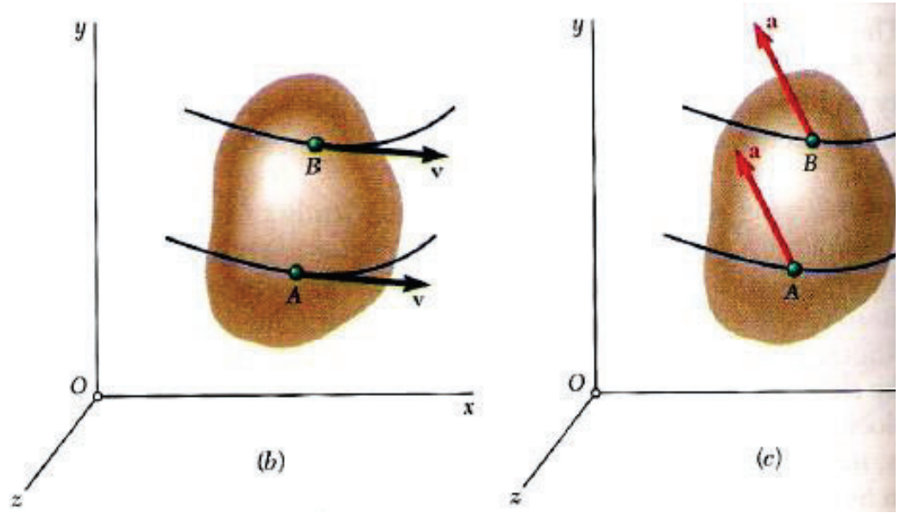
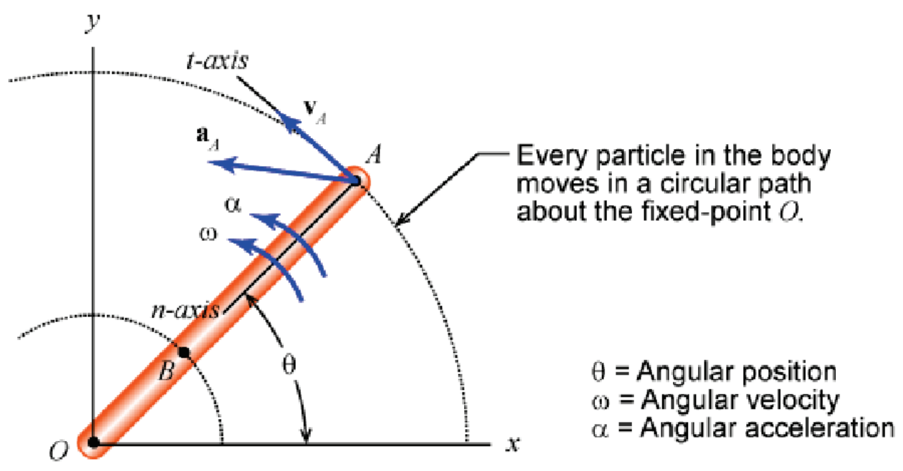
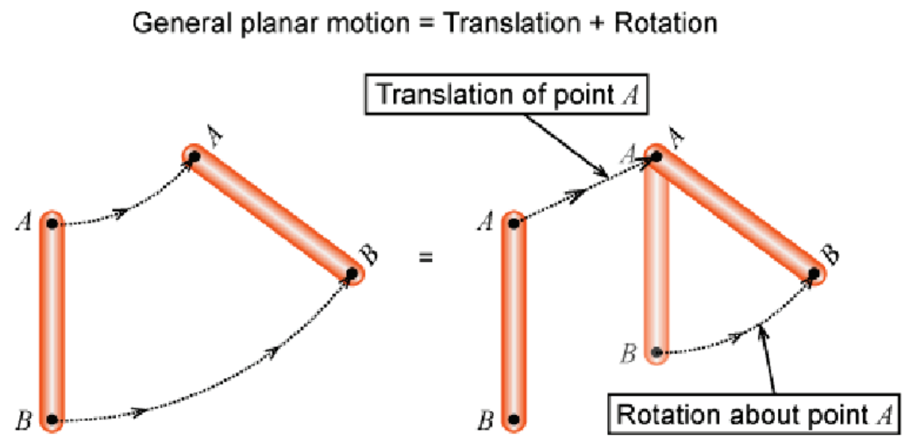
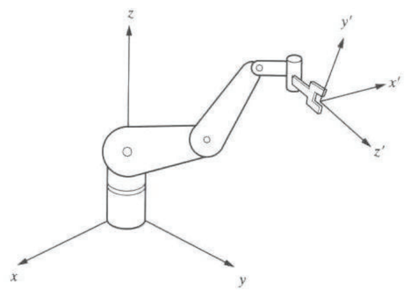
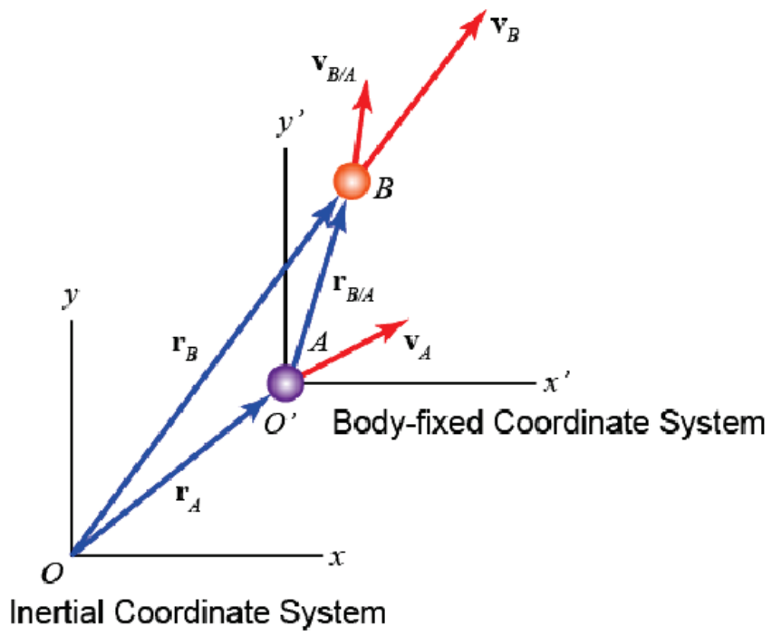

&emsp;
# Description

## 1 Translation
All the points of the body have the same velocity and the same acceleration.

$$\begin{aligned}
& \overrightarrow{v_B}=\overrightarrow{v_A} \\
& \overrightarrow{a_B}=\overrightarrow{a_A}
\end{aligned}$$

    

&emsp;
## 2 Rotation
velocity vector: $\vec{v}_A=r_A \omega \vec{e}_t$

acceleration vector: $\vec{a}_A=r_A \alpha \vec{e}_t+r_A \omega^2 \vec{e}_n$

    

&emsp;
## 3 General motion
The motion of the rigid body may be described as a simple superposition of the body's translation and rotation

    

&emsp;
## 4 Absolute & relative motion
>Absolute Motion
- measured from a fixed coordinate frame, normally the ground or anything rigidly attached to the ground and not moving

>Relative Motion
- measured relative to a coordinate frame that may itself be moving

>Inertial Coordinate Frame
- non-accelerating and non-rotating
>Body-fixed coordinate frame
- a body-fixed reference frame is fixed to a body that is usually moving

<table align=center><tr>
    <td></td>
    <td></td>
</tr></table>
&emsp;