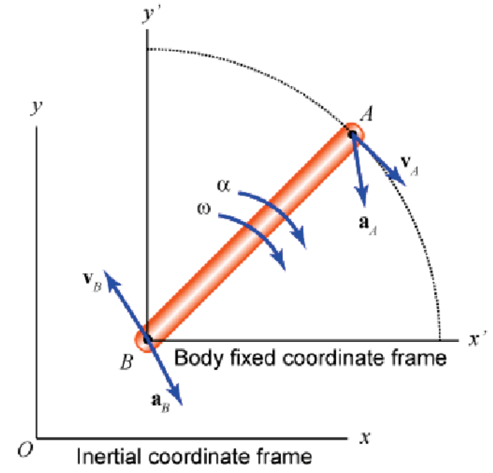
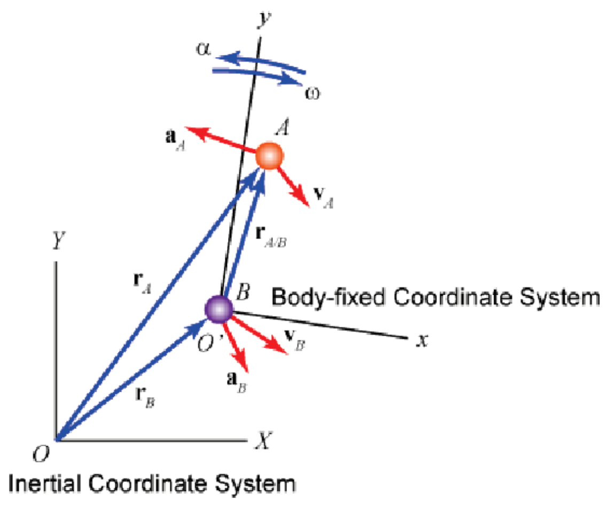

&emsp;
# Example 
## 1 translating coordinate frame
- position vector: $\vec{r}_A=\vec{r}_B+\vec{r}_{A / B}$
- velocity vector:
$$
\begin{aligned}
\vec{v}_A & =\vec{v}_B+\vec{v}_{A / B} \\
& =\vec{v}_B+r_{A B} \omega \vec{e}_t \text { (rotation) }
\end{aligned}
$$
- acceleration vector:
$$
\begin{aligned}
\vec{a}_A & =\vec{a}_B+\vec{a}_{A / B} \\
& =\vec{a}_B+r_{A B} \alpha \vec{e}_t+r_{A B} \omega^2 \vec{e}_n
\end{aligned}
$$

    

&emsp;
## 2 rotating coordinate frame

- position vector:
$$
\begin{aligned}
\vec{r}_A & =\vec{r}_B+\vec{r}_{A / B} \\
& =\vec{r}_B+(x \vec{\imath}+y \vec{\jmath})
\end{aligned}
$$

- velocity vector:
$$
\vec{v}_A=\vec{v}_B+\vec{v}_{A / B}=\vec{v}_B+(\dot{x} \vec{\imath}+x \dot{\vec{\imath}}+\dot{y} \vec{\jmath}+y \dot{\vec{\jmath}})
$$

    

how to better describe a rotating coordinate frame?
