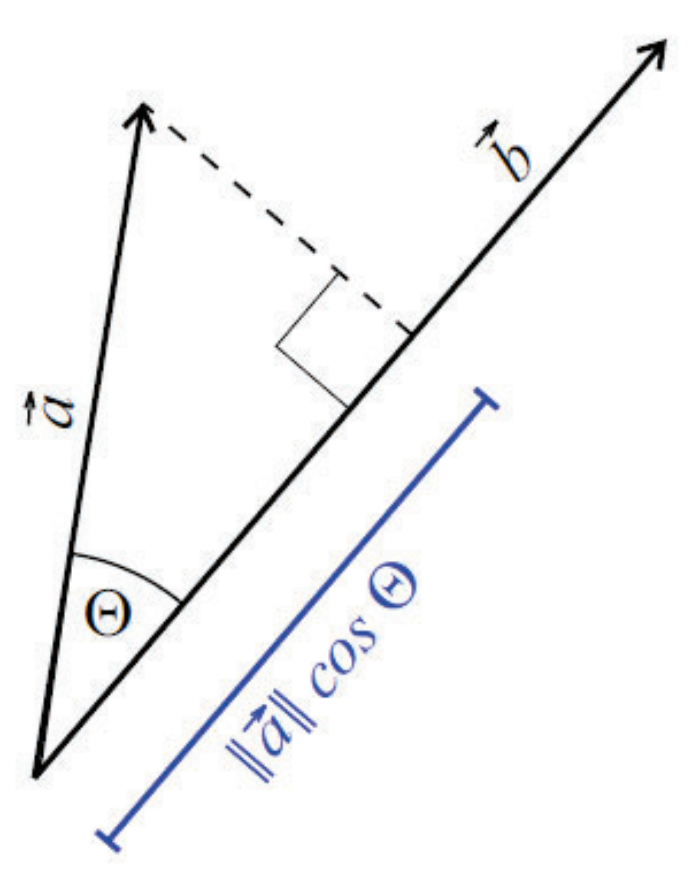
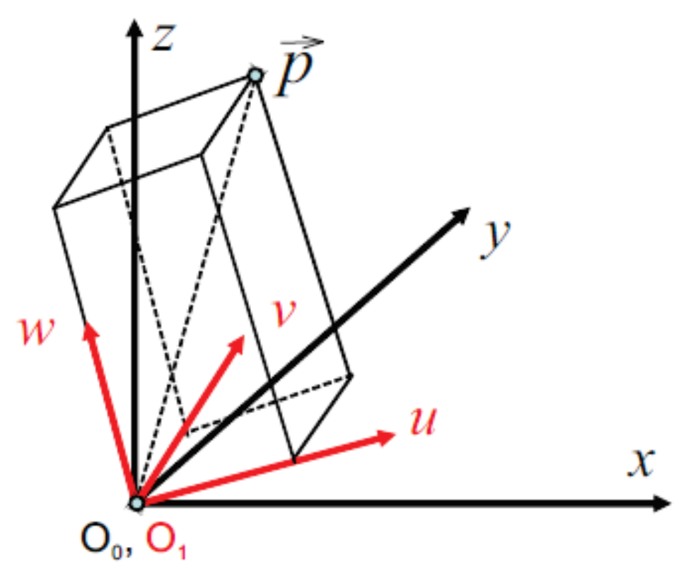

&emsp;
# Matrix Operation

## 1 Math Review

    

Dot product of vectors $\vec{a}, \vec{b}$
(also scalar or inner product)
>Geometric definition
$$\vec{a} \cdot \vec{b}=\|\vec{a}\|\|\vec{b}\| \cos \Theta$$

>Algebraic definition
$$\vec{a} \cdot \vec{b}=\sum_{i=1}^n a_i b_i$$

>A two-dimensional example
$$
\begin{aligned}
& \vec{a}=\left[a_x, a_y\right]^{\top}, \quad \vec{b}=\left[b_x, b_y\right]^{\top} \\
& \vec{a} \cdot \vec{b}=\left[\begin{array}{l}
a_x \\ a_y
\end{array}\right] \cdot\left[\begin{array}{l}
b_x \\ b_y
\end{array}\right]=a_x b_x+a_y b_y
\end{aligned}$$

&emsp;
## 2 Rotation

    

It is of advantage to express the rotation as a matrix operation.

Consider a vector in two coordinate frames:

$$
\begin{aligned}
& \vec{p}_{x y z}=p_x \vec{\imath}_x+p_y \vec{\jmath}_y+p_z \vec{k}_z \\
& \vec{p}_{u v w}=p_u \vec{\imath}_u+p_v \vec{\jmath}_v+p_w \vec{k}_w
\end{aligned}
$$

There is rotation matrix $\mathrm{R}$ s.t.
$$\vec{p}_{x y z}=\mathrm{R} \vec{p}_{u v w}$$

$p_x, p_y, p_z$ represent projections of $\vec{p}$ onto $x, y, z$ axes, respectively:
$$
\begin{aligned}
& p_x=\vec{\imath}_x \cdot \vec{p}=\vec{\imath}_x \cdot \vec{\imath}_u p_u+\vec{\imath}_x \cdot \vec{\jmath}_v p_v+\vec{\imath}_x \cdot \vec{k}_w p_w \\
& p_y=\vec{\jmath}_y \cdot \vec{p}=\vec{\jmath}_y \cdot \vec{\imath}_u p_u+\vec{\jmath}_y \cdot \vec{\jmath}_v p_v+\vec{\jmath}_y \cdot \vec{k}_w p_w \\
& p_z=\vec{k}_z \cdot \vec{p}=\vec{k}_z \cdot \vec{\imath}_u p_u+\vec{k}_z \cdot \vec{\jmath}_v p_v+\vec{k}_z \cdot \vec{k}_w p_w
\end{aligned}
$$

in a matrix form

$$\left[\begin{array}{l}
p_x \\ p_y \\ p_z
\end{array}\right]=\left[\begin{array}{ccc}
\vec{\imath}_x \cdot \vec{\imath}_u & \vec{\imath}_x \cdot \vec{\jmath}_v & \vec{\imath}_x \cdot \vec{k}_w \\
\vec{\jmath}_y \cdot \vec{\imath}_u & \vec{\jmath}_y \cdot \vec{\jmath}_v & \vec{\jmath}_y \cdot \vec{k}_w \\
\vec{k}_z \cdot \vec{\imath}_u & \vec{k}_z \cdot \vec{\jmath}_v & \vec{k}_z \cdot \vec{k}_w
\end{array}\right]\left[\begin{array}{c}
p_u \\ p_v \\ p_w \end{array}\right]$$

