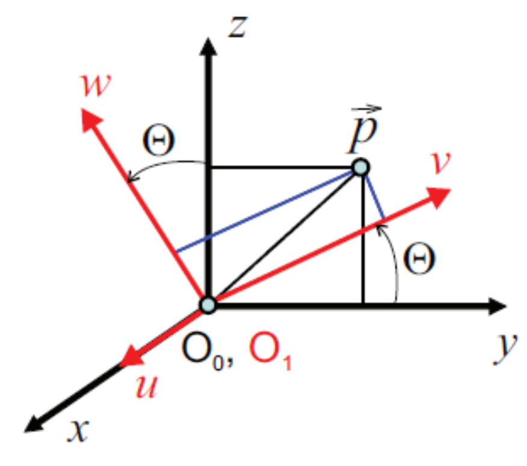
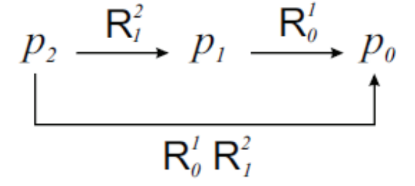

&emsp;
# Example - Rotation Matirx

## 1 Rotation

    

$$\left[\begin{array}{c}
p_x \\ p_y \\ p_z
\end{array}\right]=\left[\begin{array}{ccc}
\vec{\imath}_x \cdot \vec{\imath}_u & \vec{\imath}_x \cdot \vec{\jmath}_v & \vec{\imath}_x \cdot \vec{k}_w \\
\vec{\jmath}_y \cdot \vec{\imath}_u & \vec{\jmath}_y \cdot \vec{\jmath}_v & \vec{\jmath}_y \cdot \vec{k}_w \\
\vec{k}_z \cdot \vec{\imath}_u & \vec{k}_z \cdot \vec{\jmath}_v & \vec{k}_z \cdot \vec{k}_w
\end{array}\right]\left[\begin{array}{l}
p_u \\ p_v \\ p_w
\end{array}\right]$$

>Rotation about axis $x$ by $\Theta$ 
$$R=R(x, \Theta)=\left[\begin{array}{rrr}
1 & 0 & 0 \\
0 & \cos \Theta & -\sin \Theta \\
0 & \sin \Theta & \cos \Theta
\end{array}\right]$$

>Rotation about axis $y$ by $\Theta$ :
$$
R=R(y, \Theta)=\left[\begin{array}{rrr}
\cos \Theta & 0 & \sin \Theta \\
0 & 1 & 0 \\
-\sin \Theta & 0 & \cos \Theta
\end{array}\right]
$$

>Rotation about axis $z$ by $\Theta$ :
$$
R=R(z, \Theta)=\left[\begin{array}{rrr}
\cos \Theta & -\sin \Theta & 0 \\
\sin \Theta & \cos \Theta & 0 \\
0 & 0 & 1
\end{array}\right]
$$

&emsp;
## 2 Composite rotation matrix

A sequence of finite rotations.

Matrix multiplications do not commute $\Rightarrow$ the correct order is important.

Point $\vec{p}$ is represented as $\vec{p}_0$ w.r.t. to its coordinates $O i_0 j_0 k_0$.

Point $\vec{p}_1$ similarly as $\vec{p}_1$ w.r.t. $O i_1 j_1 k_1$.

Point $\vec{p}_2$ similarly as $\vec{p}_2$ w.r.t. $O i_2 j_2 k_2$.

$\vec{p}_0=R_0^1 \vec{p}_1 \text { and } \vec{p}_1=R_1^2 \vec{p}_2 $

$R_0^2=R_0^1 R_1^2 \text {, consequently } \vec{p}_0=R_0^2 \vec{p}_2$

    

1. Rotation around the current $z$-axis by the angle $\Theta$.
2. Rotation around the current $y$-axis by the angle $\Phi$.
$$
\begin{aligned}
\mathrm{R}=\mathrm{R}(y, \Phi) \mathrm{R}(z, \Theta) & =\left[\begin{array}{rrr}
\cos \Phi & 0 & \sin \Phi \\
0 & 1 & 0 \\
-\sin \Phi & 0 & \cos \Phi
\end{array}\right]\left[\begin{array}{rrr}
\cos \Theta & -\sin \Theta & 0 \\
\sin \Theta & \cos \Theta & 0 \\
0 & 0 & 1
\end{array}\right] \\
& =\left[\begin{array}{rrr}
\cos \Phi \cos \Theta & -\cos \Phi \sin \Theta & \sin \Phi \\
\sin \Theta & \cos \Theta & 0 \\
-\sin \Phi \cos \Theta & \sin \Phi \sin \Theta & \cos \Phi
\end{array}\right]
\end{aligned}
$$