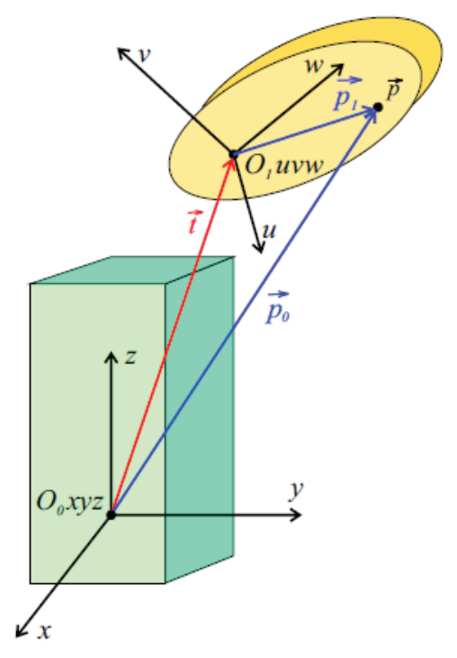

&emsp;
# Rotation Translation

## 1 Rotation + Translation

    

A point (vector) $\vec{p}$ originally expressed with respect to the coordinate system $O_1 u v w$ as $\vec{p}_1$ is newly represented with respect to the coordinate system $O_0 x y z$ as $\vec{p}_0$.

The transformation writes as $\vec{p}_0=\mathrm{R} \vec{p}_1+\vec{t}$, where $\mathrm{R}$ is the rotation matrix aligning the coordinate system $O_0 x y z$ to $O_1 u v w$ and $\vec{t}$ is a translation vector bringing the origin $O_0$ to the origin $O_1$.

&emsp;
## 2 Homogeneous transformation

Express $\overrightarrow{p_0}, \overrightarrow{p_1}$ in homogeneous coordinates as $\vec{p}_{0 h}, \vec{p}_{1 h}$

$$\vec{p}_{0 h}=\left[\begin{array}{c}
\vec{p}_0 \\ 1
\end{array}\right], \vec{p}_{1 h}=\left[\begin{array}{c}
\vec{p}_1 \\ 1
\end{array}\right]$$

The joint rotation and translation can be written in the matrix form

$$\vec{p}_{0 h}=\left[\begin{array}{c|c}
\mathrm{R} &  \vec{t} \\
\hline 0 \ 0 \ 0 & 1
\end{array}\right] \vec{p}_{1 h}$$

&emsp;
## 3 
Representation of end-point position in $x_0-y_0-z_0$

Find coordinate in $x_3-y_3-z_3$

Find composite transformation matrix from $x_3-y_3-z_3$ to $x_0-y_0-z_0$