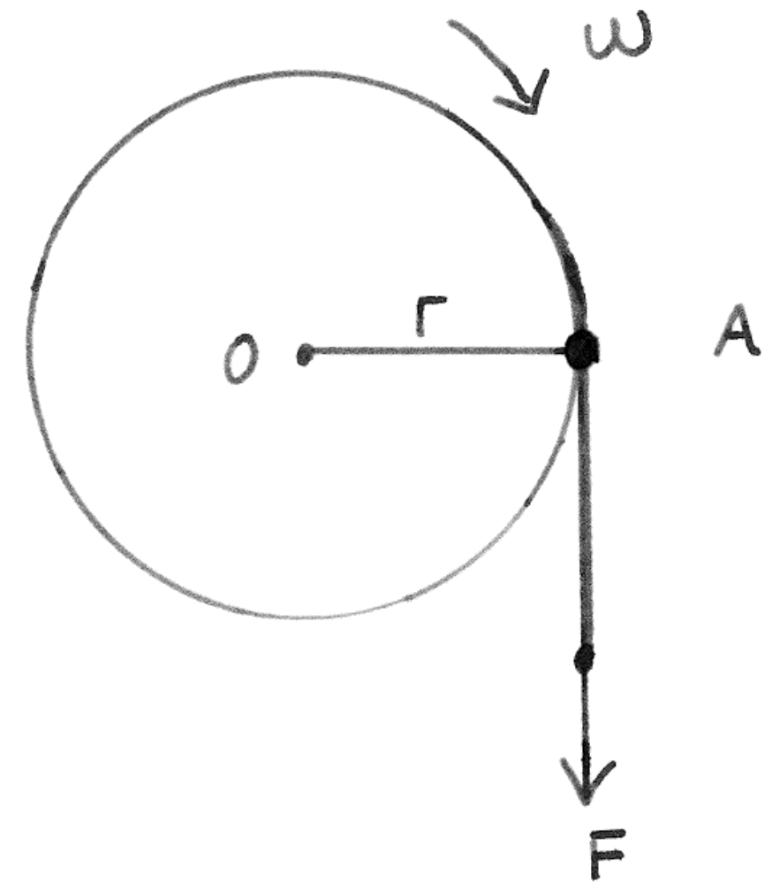

&emsp;
# Question 1: Position, Velocity, Acceleration

A piece of string is wrapped around a pulley of `radius 0.25m`, initially at rest. A force `F` is applied to the  string as shown in the figure below, and it is determined that the resultant acceleration of the string is `a = 4t (m/s^2)`. You may assume that there is no slip between the string and the pulley 
1. Determine the angular velocity of the pulley as a function of time
2. Determine the angular position of OA in radians, measured clockwise relative to the horizontal 
axis, as a function of time

    

&emsp;
## Solution
1. At '$A$' there is an acceleration, in the normal and the tangential directions for the pulley. The string must be tangent to the pulley at $A$, with no slip:
    - tangential acceleration $\left(a_A\right)_T=4 t\left(~m / s^2\right)$
        $$\left(a_A\right)_T=\dot{\omega} r, 4 t=0.25 \dot{\omega} \text {, so } \dot{\omega}=16 t\left(rad / s^2\right)$$
    - Now as we know starting from its rest position: at $t=0, \omega=0 ; d \omega=16t\ dt$
    - By taking integration on both sides, $\int_0^\omega d \omega=\int_0^t 16 t d t$, so $\omega=8 t^2(rad / s)$

&emsp;
2. $\frac{d \phi}{d t}=\omega=8 t^2$ and we also know $\phi=0$, $0$ at $t=0$, so $\int_0^{\phi} d \phi=\int_0^t 8 t^2 d t$ . $\phi=2.67 t^3(rad)$.

&emsp;
## Note
This problem is one of the basic types of problem, which is all about position, velocity and acceleration for circular motion. Most important thing is stick to the definition e.g. rate of change of velocity with respect to time is acceleration.