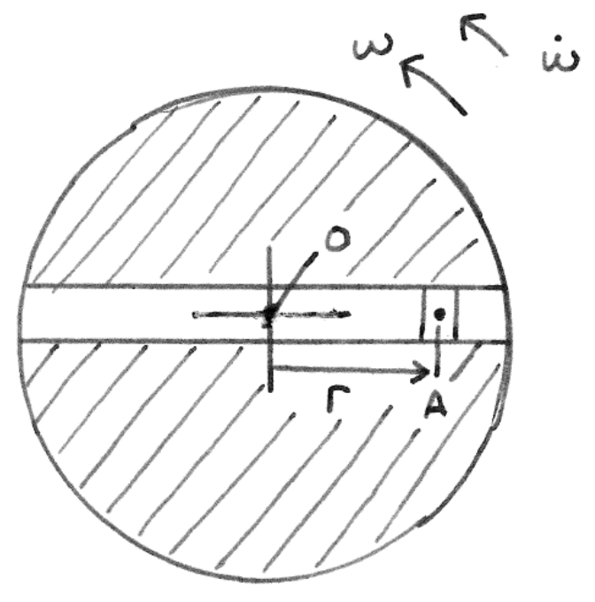

&emsp;
# Rotating Disk and a Sliding Block in a Radial Slot

    

&emsp;

The above figure shows a block that is constrained to move radially at a controlled velocity and acceleration, within a rotating disk. The disk is fixed to an origin $O$, and has an angular velocity $\omega$ and acceleration $\dot{\omega}$. The positive directions for these are counter-clockwise. You may neglect friction, and assume that the block has a negligible mass. For the purpose of the calculations, you may treat point $A$ as the block.

1. Write the equation for the acceleration of the sliding block in polar coordinates such that all unit vectors are expressed independent of time, and given that the velocity for the block can be written as:
$$\vec{v}=\dot{r} e_r+r \dot{e}_r=\dot{r} e_r+r \dot{\theta} e_\theta$$

2. If the angular velocity is $10\ rad / s$, and the angular acceleration is $-10\ rad / s^2$, and $r=$ $1.5 ~m, \dot{r}=0.1 ~m / s$ and $\ddot{r}=0.1 ~m / s^2$, determine, at the instant described, the following quantities:
    - the velocity of point $A$, including the angle relative to the polar coordinate system;
    - the acceleration of point $A$, including the angle relative to the polar coordinate system.

3. In the equation for the acceleration, determined in part 1, identify the mathematical definition of the following acceleration components: Coriolis, centripetal, and Euler. Give three examples where each type of acceleration component is present.

&emsp;
## Solutions
>Solution to 1 
- Acceleration $\alpha=\frac{d \vec{v}}{d t}=\frac{d\left(\dot{r} e_r+r \dot{\phi} e_{\phi}\right)}{d t}$

- According to product rule of derivatives: 
    $$\alpha=\ddot{r} e_r+\dot{r} \dot{e}_r+\dot{r} \dot{\phi} e_{\phi}+r \ddot{\phi} e_{\phi}+r \dot{\phi} \dot{e}_{\phi} \tag{1}$$

- Change unit vector derivatives to just unit vectors, using
$\dot{\boldsymbol{e}}_r=\dot{\phi} \boldsymbol{e}_{\phi} \quad$ and $\dot{\boldsymbol{e}}_{\phi}=-\dot{\phi} e_r$.
- Thus (1) becomes $\alpha=\ddot{r} e_r+\dot{r} \dot{\phi} e_{\phi}+\dot{r} \dot{\phi} e_{\phi}+r \ddot{\phi} e_{\phi}+r \dot{\phi}\left(-e_r \dot{\phi}\right)$
- Gathering $e_r$ and $\boldsymbol{e}_{\phi}$ terms together:      
    $$\alpha=\left(\ddot{r}-r \dot{\phi}^2\right) e_r+(r \ddot{\phi}+2 \dot{r} \dot{\phi}) e_{\phi}$$

&emsp;
>Solution to 2

1. Using the provided equation: 
    $$v=\dot{r}=\dot{r} e_r+r \dot{\phi} e_{\phi}=0.1 e_r+15 e_{\phi}$$
    - magnitude: $\sqrt{0.1^2+15^2}=15 \mathrm{~m} / \mathrm{s}$

    - angle: $\tan ^{-1}\left(\frac{15}{0.1}\right)=89.6^{\circ}$

2. Acceleration from the equation in part 1:
    $$\alpha=\left(\ddot{r}-r \dot{\phi}^2\right) e_r+(r \ddot{\phi}+2 \dot{r} \dot{\phi}) e_{\phi}=(-149.9) e_r+(-13) e_{\phi}$$

    - magnitude: $\sqrt{(-149.9)^2+(-13)^2}=150 \mathrm{~m} / \mathrm{s}^2$

    - angle: $\tan ^{-1}\left(\frac{13}{149.9}\right)=4.96^{\circ}$

&emsp;
>Solution 3
- centripetal: $r \dot{\phi}^2$

- Euler: $r \ddot{\phi}$

- Coriolis: $2 \dot{r} \dot{\varnothing}$

- Centripetal: Circular motion with a constant speed.
- Euler: Circular motion with a non-zero angular acceleration.
- Coriolis: Circular motion with constant speed coupled with radial velocity.