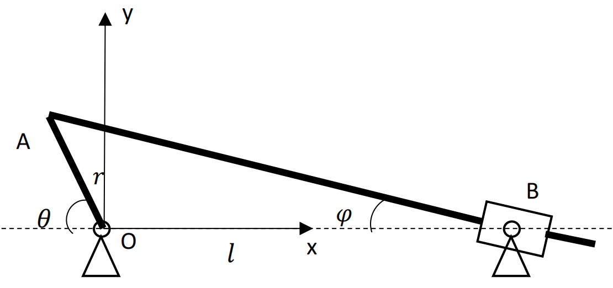

&emsp;
# Question 3:  Inverted slider crank mechanism

    

&emsp;

The above figure shows an inverted slider crank mechanism, where the crank OA with a radius $r$ rotates about point $\mathrm{O}$ and the slider $\mathrm{AB}$ moves between the guides rotating about point $\mathrm{B}$. The distance between $O$ and $\mathrm{B}$ is $l . \theta$ is the angle between the $\mathrm{x}$-axis and the crank and $\varphi$ is the angle between the $x$-axis and the slider, as specified in the figure. The angular velocity and acceleration of the crank are given as $\dot{\theta}$ and $\ddot{\theta}$, respectively.
1. Derive an equation for the angle $\varphi$ as a function of angle $\theta$.
2. Derive an equation for the angular velocity $\dot{\varphi}$ as a function of the angles $\varphi, \theta$ and the angular velocity of the crank $\dot{\theta}$.
3. Assuming the length of $\mathrm{AB}$ is $s$, derive an equation for the speed $\dot{s}$ as a function of the angle $\theta$ and the angular velocity of the crank $\dot{\theta}$.

&emsp;
## Solution
>Solution to 1
- equation for the angle $\varphi$ as a function of angle $\theta: \tan \varphi=\frac{r \sin \theta}{r \cos \theta+l}$

- Note: you don't necessarily write in the form $\varphi=\arctan \frac{r \sin \theta}{r \cos \theta+l}$

&emsp;
>Solution to 2
- By taking the time derivative of both sides of (1), we have
$$
\frac{\dot{\varphi}}{\cos ^2 \varphi}=\frac{r \cos \theta \cdot \dot{\theta}(r \cos \theta+l)+r^2 \sin ^2 \theta \cdot \dot{\theta}}{(r \cos \theta+l)^2}=\frac{(l \cos \theta+r) r \dot{\theta}}{(r \cos \theta+l)^2} \tag{2}
$$

- Note: again you don't necessarily write in the form $\dot{\varphi}=\cos ^2 \varphi \frac{(l \cos \theta+r) r \dot{\theta}}{(r \cos \theta+l)^2}$

&emsp;
>Solution to 3
- equation for the length of $\mathrm{AB}: s=\frac{r \sin \theta}{\sin \varphi}$

    By taking its time derivative, we have

    $\dot{S}=\frac{r \cos \theta \cdot \dot{\theta} \sin \varphi-r \sin \theta \cos \varphi \cdot \dot{\varphi}}{\sin ^2 \varphi}$ where $\dot{\varphi}$ is obtained in (2).