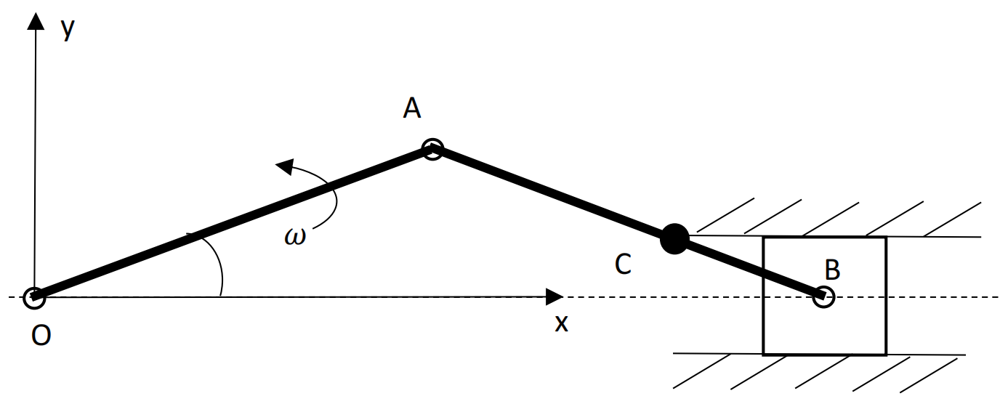

&emsp;
# Question 4: Slider crank mechanism

    

&emsp;

The above figure shows a slider crank mechanism, where the crank with a radius $l$ rotates about point $O$ and the slider moves between the guides along the $x$-axis. The rod with a length $l$ connects the crank at point $A$ and the slider at point $B$. The angular velocity of the crank is given as a constant $\omega$. A point $C$ is on the rod $A B$ with $A C=\frac{3}{4} l$.
1. Assuming that the position of point $O$ is at the origin of the $x-y$ coordinate system, determine an equation for the position of point $C$.
2. Determine an equation for the velocity of point $C$, in terms of its magnitude and direction.
3. Determine an equation for the acceleration of point $C$, in terms of its magnitude and direction.
4. If the angular velocity $\omega$ is not a constant, would the equation for the velocity of point $C$ be the same as that in Question 2?
5. Assuming that the angular velocity $\omega$ is not a constant, express the velocity and acceleration of slider B using parameters $\omega, \dot{\omega}$.

&emsp;
## Solution
>Solution to 1
- Since the angular velocity is a constant, the angle is $\theta=\omega t$
- With the angle $\theta$ known, $\mathrm{x}$-coordinate of point $\mathrm{C}$ is $x_C=l \cos \theta+\frac{3}{4} l \cos \theta=\frac{7}{4} l \cos \theta$
y-coordinate of point C: $y_C=\frac{1}{4} l \sin \theta$

&emsp;
>Solution to 2
- By taking the time derivative of the position equation in 1, we have the velocity
    $$\begin{aligned}
    & \dot{x}_C=-\frac{7}{4} l \sin \theta \cdot \omega \\
    & \dot{y}_C=\frac{1}{4} l \cos \theta \cdot \omega
    \end{aligned}$$
    - magnitude of the velocity vector: $\sqrt{\dot{x}_C{ }^2+\dot{y}_C{ }^2}$
    - direction of the velocity vector: $\arctan \frac{\dot{y}_C}{\dot{x}_C}$

&emsp;
>Solution to 3
- By taking the time derivative of the velocity equation in 2, we have the acceleration
$$\begin{aligned}
\ddot{x}_C & =-\frac{7}{4} l \cos \theta \cdot \omega^2 \\
\ddot{y}_C & =-\frac{1}{4} l \sin \theta \cdot \omega^2
\end{aligned}$$
- magnitude of the acceleration vector: $\sqrt{\ddot{x}_C{ }^2+\ddot{y}_C{ }^2}$, direction of the acceleration vector: $\arctan \frac{\ddot{y}_C}{\ddot{x}_C}$

&emsp;
>Solution to 4
- yes, as can be seen in solution part 2

&emsp;
>Solution to 5
- The position vector of point B includes $x_B=2 l \cos \theta, y_B=0$, where the angle $\theta=\int \omega d t$.

- By taking the time derivative of the position, we have the velocity 
    $$\dot{x}_B=-2 l \sin \theta \cdot \omega$$
- By taking the time derivative of the velocity, we have the acceleration
    $$\ddot{x}_B=-2 l \cos \theta \cdot \omega^2-2 l \sin \theta \cdot \dot{\omega}$$