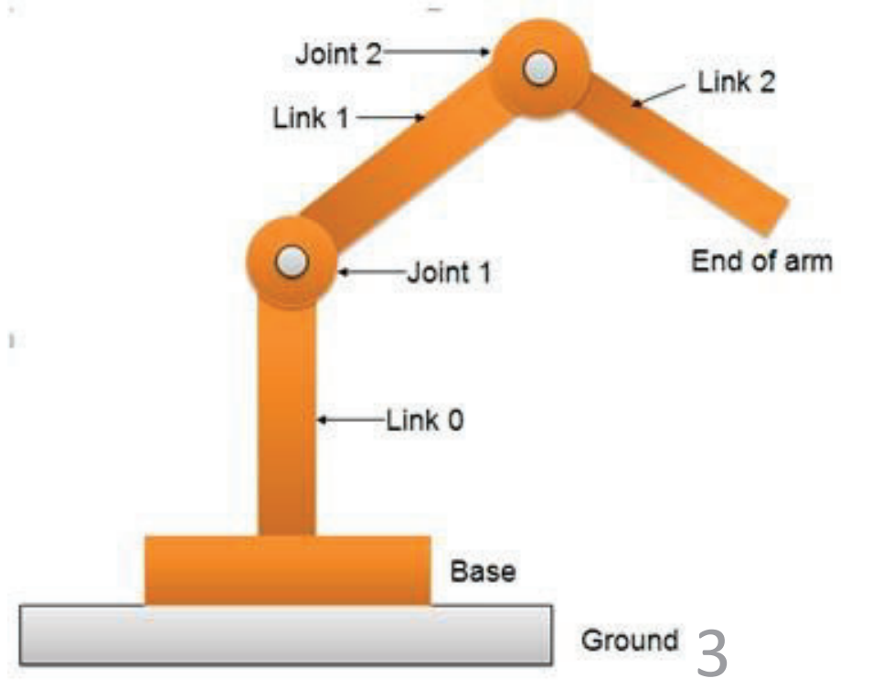
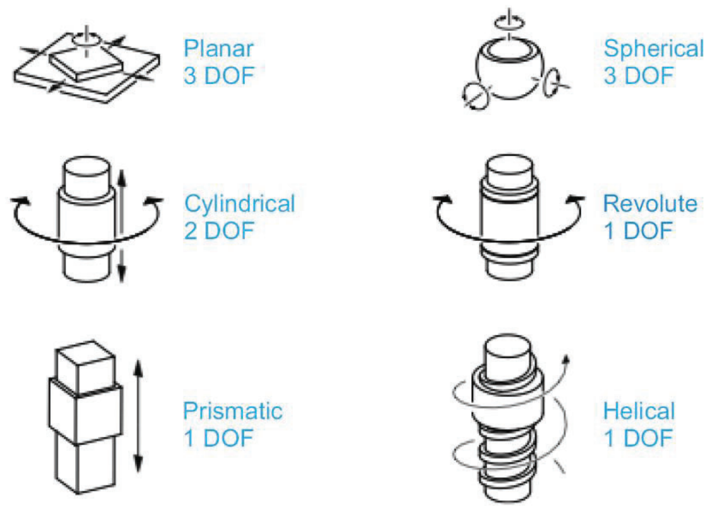
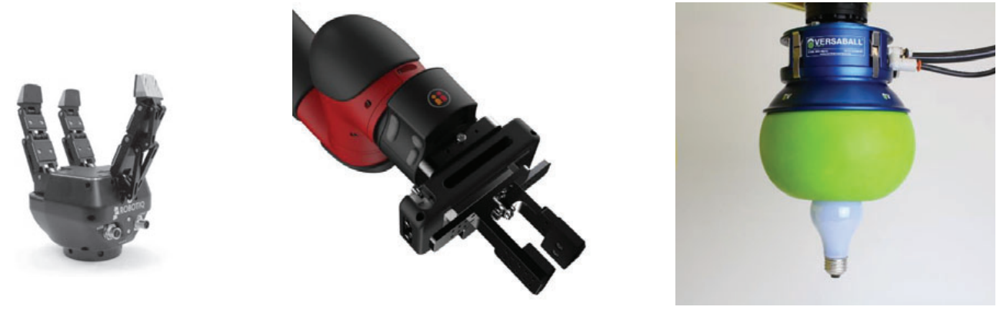
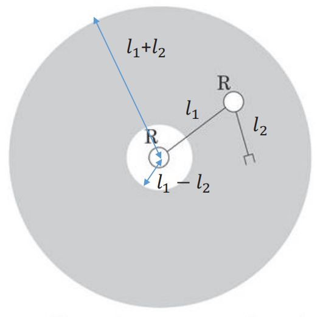
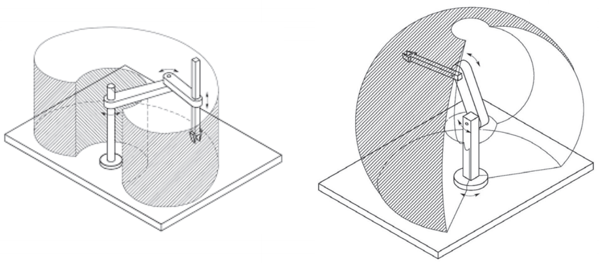

&emsp;
# Intro
- Joints provide relative motion
    - linear joint
    - rotary/revolute joint
- Links are rigid members between joints
- End-effector
- Workspace
- Reference frame
- Degree of freedom (DOF)

    

&emsp;

## 1 Joint
- linear joint
- rotary/revolute joint

    

&emsp;
## 2 End-effector
Enables a robot to perform a certain task
- grippers: grasp and manipulate objects during a work cycle
- tools: perform a process, e.g., spot welding, spray painting

    

&emsp;
## 3 Workspace
>Workspace
- the volume of space that the end effector can reach
>Reachable Workspace
- the volume of the space in which every point can be reached by the end-effector in at least one orientation
>Dexterous Workspace
- the volume of the space in which every point can be reached by the end-effector in all possible orientations

&emsp;
## 4 Workspace Example
>Example 1
- Reachable workspace: shadowed area 
    - length of each link: $l_1, l_2$
    - $l_1>l_2$

    

>Example 2
- Reachable workspace: shadowed area

    

