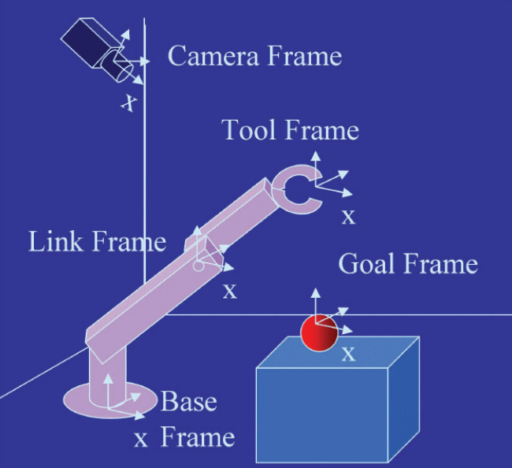
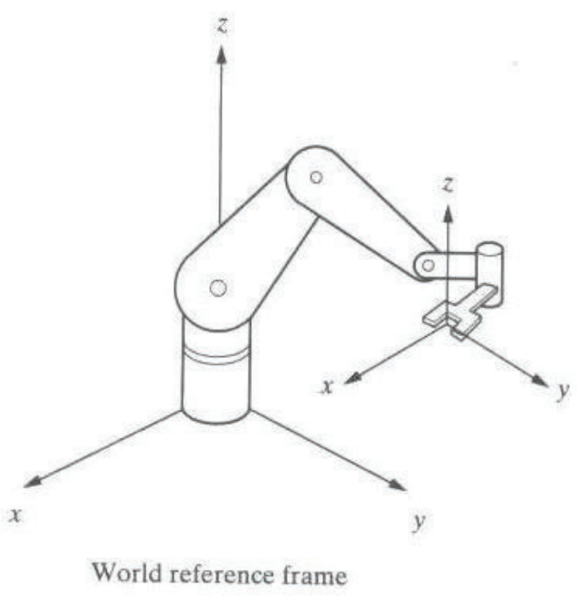
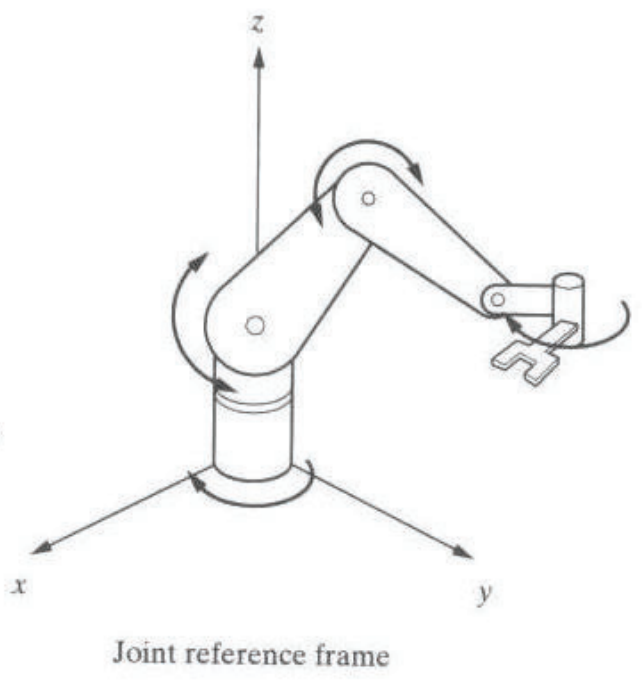
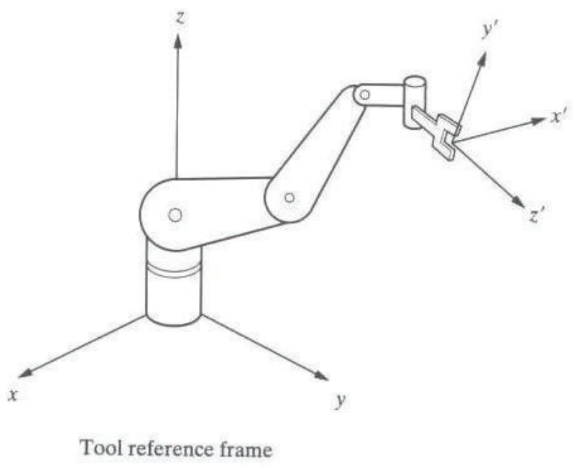

&emsp;
# Reference Frame
Reference frames in a typical robotic task

    

>World reference frame
- a universal coordinate frame attached to ground or fixed base

    

>Joint reference frame
- attached to each individual joint of the robot

    

>Tool reference frame
- attached to the end effector (tool)

    

