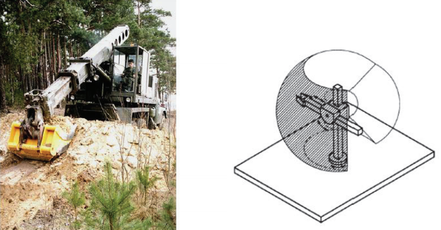

&emsp;
# Manipulator

## 1 Open Chain (Serial) Manipulator

A manipulator can be represented as a chain of rigid bodies (links) connected by revolute or prismatic joints.
- One end of the chain is constrained to a base, while an end effector is mounted to the free end of the chain.
- The resulting motion is obtained by composition of the elementary motions of each link with respect to the previous one.

    

&emsp;
## 2 Closed Chain (Parallel) Manipulator
- Much more difficult to analyse.
- Analysis may take into account statics, constraints from other links, etc.
- Main advantages: higher loading capability, higher stiffness.

    

&emsp;
## 3 Typical Manipulator

>PPP

    

>RPP

    

>RRP

    

>RRR

    

>RRRP
- SCARA: Selective Compliance Assembly Robot Arm

    

>Stewart platform
- 6 prismatic joints

    

