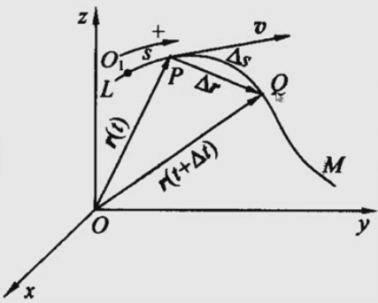
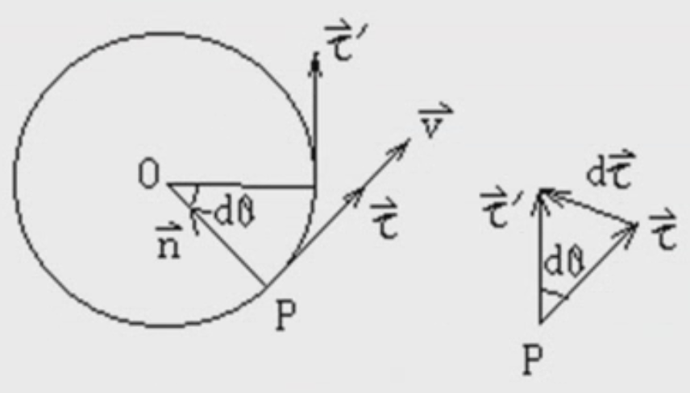

&emsp;
# 自然坐标下的速度、加速度

## 1 线速度
某一时刻 $t$ 处于 $P$ 点位置, 经过一定时间 $\Delta t$ 之后，移动到点 $Q$

    

我们由之前的知识可以知道:
$$\vec{v}=\lim _{\Delta t \rightarrow 0} \frac{\Delta \vec{r}}{\Delta t}$$

简单的用数学技巧做一下变换:
$$\lim \left(\frac{\Delta \vec{r}}{\Delta s} \frac{\Delta s}{\Delta t}\right)
=\left(\lim \frac{\Delta \vec{r}}{\Delta s}\right)\left(\lim \frac{\Delta s}{\Delta t}\right)=\frac{d \vec{r}}{d s} \frac{d s}{d t} $$

>方向
- 当 $Q$ 无限靠近 $P$ 点时，位移的大小 $\Delta r$ 和弧长 $\Delta s$ 的大小相等
- 无限靠近时 $\tau$ 的方向就是 $P$ 点的切线方向
    $$ \left(\lim _{\Delta t \rightarrow 0} \frac{\Delta \vec{r}}{\Delta s}\right)=\frac{d \vec{r}}{d s}=\vec{\tau} \\
    $$

>大小 Magnetude
- 大小就是这段无穷小的弧长的大小
$$v=\lim _{\Delta t \rightarrow 0} \frac{\Delta s}{\Delta t}=\frac{d s}{d t}$$

>线速度
$$\vec{v}=v \vec{\tau}=\frac{d s}{d t} \vec{\tau}$$

>切线方向、法向单位矢量
$$\vec{\tau} \equiv \vec{e}_t, \quad \vec{n} \equiv \vec{e}_n$$

&emsp;
## 2 加速度

    

>速度/速率
$$\quad \vec{v}=v \vec{\tau}=\frac{d s}{d t} \vec{\tau}$$

>加速度
$$\quad \vec{a}=\frac{d}{d t}(v \vec{\tau})=\frac{d v}{d t} \vec{\tau}+v \frac{d \vec{\tau}}{d t}$$
- 其中, $d \vec{\tau}$ 微分可以看作是弧长 $|\tau| d \theta$, 微分时, 无限接近 $P$ 点, 方向为法线方向 $\vec{n}$, 所以:
    $$d \vec{\tau}=|\tau| d \theta \vec{n}=d \theta \vec{n}$$
- 所以
    $$\frac{d \vec{\tau}}{d t}=\frac{d \theta}{d t} \vec{n}=\frac{R d \theta}{R d t} \vec{n}=\frac{1}{R} \frac{d s}{d t} \vec{n}=\frac{v}{R} \vec{n}$$
- 所以
$$\vec{a}=\frac{d v}{d t} \vec{\tau}+\frac{v^2}{R} \vec{n}=a_\tau \vec{\tau}+a_n \vec{n}$$
